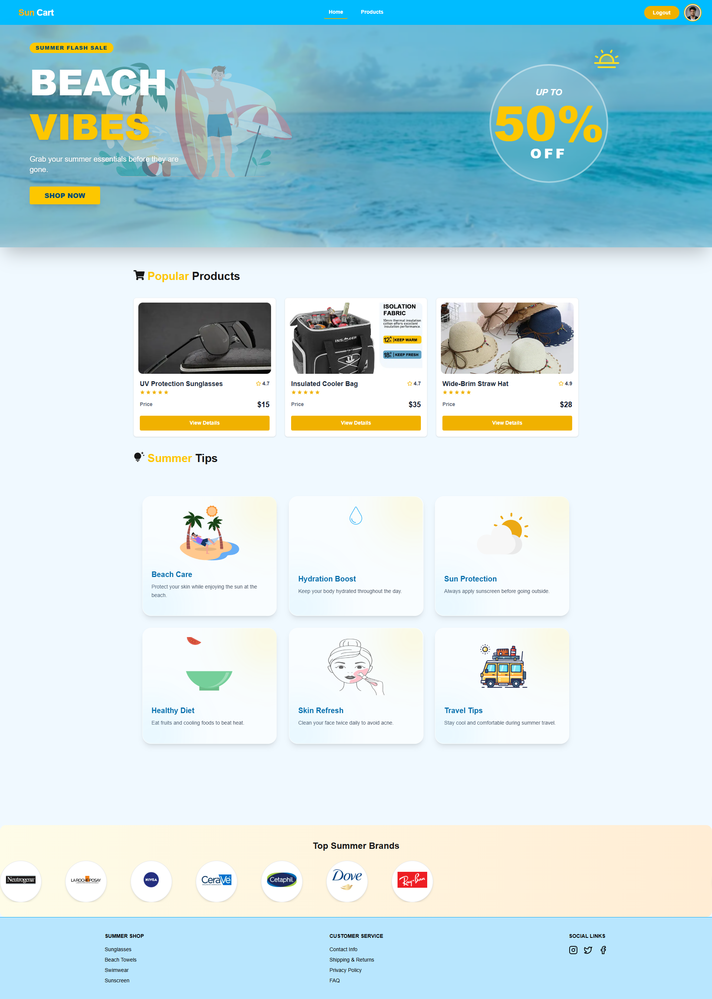
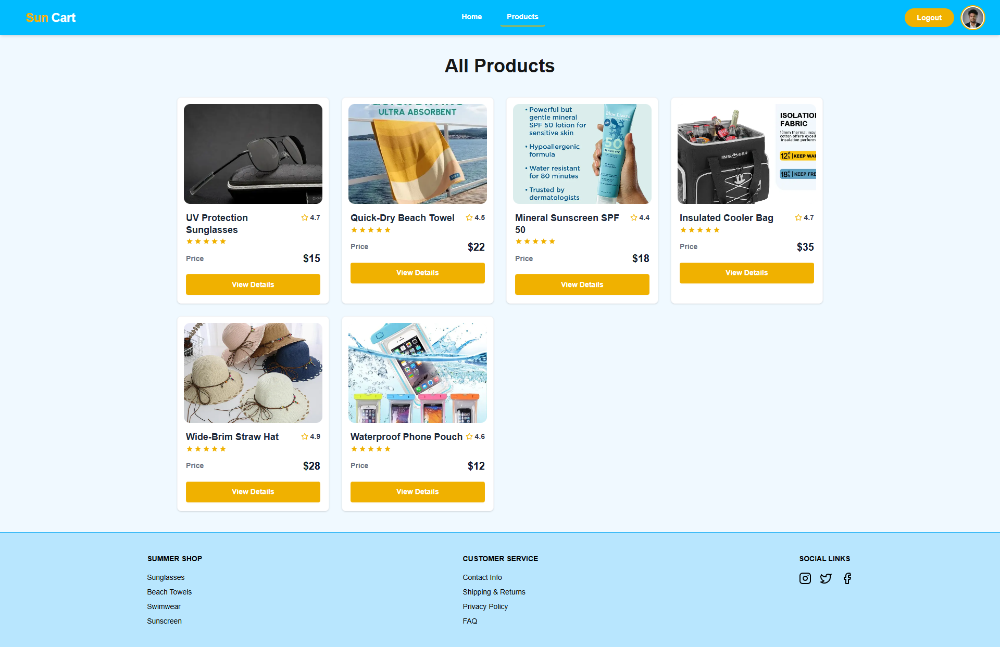
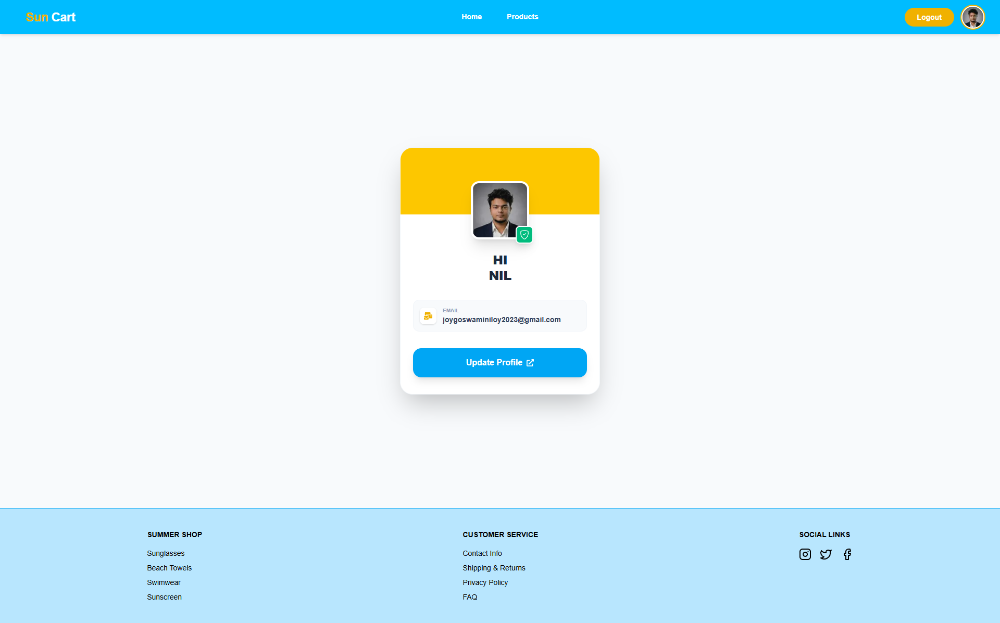
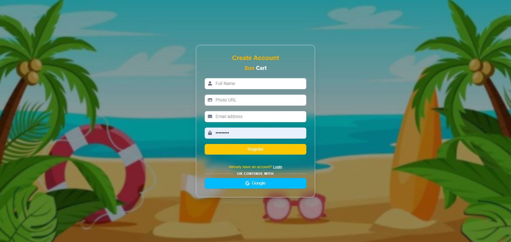

# 🌞 Sun Cart

## 📌 Project Purpose

**Sun Cart** is a modern e-commerce web application designed to provide users with a smooth and responsive online shopping experience. It allows users to browse products, view details, and manage their shopping journey efficiently.

---

## 🚀 Live URL

🔗 [Explore Sun Cart Live](https://sun-cart-self.vercel.app)

---

## 📸 Screenshots

### Main Interface
<table width="100%">
  <tr>
    <td width="50%" align="center">
      <h3>🏠 Home View</h3>
      
    </td>
    <td width="50%" align="center">
      <h3>🛍️ Products Catalog</h3>
      
    </td>
  </tr>
</table>

### User Experience
<table width="100%">
  <tr>
    <td width="50%" align="center">
      <h3>👤 User Profile</h3>
      
    </td>
    <td width="50%" align="center">
      <h3>📝 Registration</h3>
      
    </td>
  </tr>
</table>

---

## ✨ Key Features

* 🛍️ Browse and explore products
* 🔍 Product details page with dynamic routing
* 👤 User authentication (Login & Register)
* 🖼️ Profile management with image support
* ⚡ Fast and responsive UI using modern frameworks
* 📱 Mobile-friendly design
* 🔔 Toast notifications for user feedback

---

## 📦 NPM Packages Used

* **next** – React framework for production
* **react** – UI library
* **react-dom** – DOM rendering
* **react-hook-form** – Form handling
* **react-icons** – Icon library
* **react-toastify** – Notifications
* **better-auth** – Authentication handling
* **lottie-react** – Animations

---

## 📂 Project Structure

```text
sun-cart/
├── public/
├── src/
│   ├── app/              # Next.js App Router
│   ├── components/       # Reusable UI elements
│   ├── hooks/            # Custom React hooks
│   └── lib/              # Helper utilities and Auth configuration
├── UI/                   # Application screenshots
│   ├── Home.png
│   ├── Products.png
│   ├── Profile.png
│   └── Signup.png
├── package.json
└── README.md
